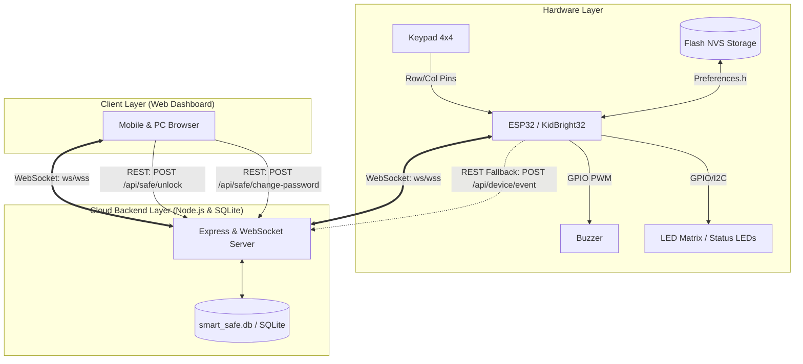

# 🛡️ ระบบตู้เซฟอัจฉริยะ (Smart Safe IoT System)

ระบบตู้เซฟอัจฉริยะแบบ Full-Stack IoT ที่เชื่อมต่อ **ESP32 / KidBright32**, **Keypad 4×4**, **LED Matrix**, และ **Buzzer** เข้ากับ **Web Dashboard** แบบเรียลไทม์ผ่าน **WebSockets** สามารถนำขึ้นระบบคลาวด์สาธารณะ (Internet) เพื่อควบคุมและดูประวัติการใช้งานได้จากสมาร์ตโฟนและคอมพิวเตอร์ทั่วโลก

---

## 🌟 ฟีเจอร์หลัก (Key Features)

1. **การควบคุมแบบ 2 ทาง (Bidirectional Real-Time Communication)**
   - **Keypad 4×4**: กรอกรหัส 4 หลัก (รหัสเริ่มต้น `1234`), กด `#` เพื่อยืนยัน, กด `*` เพื่อเคลียร์
   - **Remote Unlock**: กดปุ่ม **"OPEN SAFE"** บนเว็บไซต์เพื่อสั่งเปิดตู้เซฟจากระยะไกลผ่านอินเทอร์เน็ตได้ทันที
   - **Remote PIN Change**: เปลี่ยนรหัสผ่านจากหน้าเว็บ ระบบจะส่งรหัสใหม่ไปอัปเดตลง **Flash Memory (NVS)** ของ ESP32 แบบเรียลไทม์ รหัสใหม่มีผลที่ Keypad ทันทีแม้รีสตาร์ตเครื่อง
   - **Cloud Sync**: เมื่อบอร์ด ESP32 เริ่มทำงาน จะทำการ Sync รหัสล่าสุดจาก Cloud อัตโนมัติ

2. **ระบบตอบสนองของฮาร์ดแวร์ (Non-blocking State Machine)**
   - **เปิดสำเร็จ (SUCCESS)**: LED Matrix / ไฟแสดงสถานะ ติด 1 วินาที ดับ 1 วินาที ทำงาน 2 รอบ
   - **รหัสผิด (FAILED)**: Buzzer ร้องเตือนพร้อมไฟกระพริบ ติด 0.5 วินาที ดับ 0.5 วินาที ทำงาน 10 รอบ
   - *หมายเหตุ: ทำงานด้วย `millis()` ทำให้ระบบเครือข่าย WiFi และ WebSocket ไม่หลุดระหว่างสัญญาณเตือน*

3. **ระบบบันทึกประวัติความปลอดภัย (Real-Time Audit History)**
   - บันทึกวัน-เวลา, แหล่งที่มา (`Keypad` หรือ `Website`), สถานะ (`SUCCESS` หรือ `FAILED`), และรายละเอียด
   - **Security First**: ไม่เก็บรหัสผ่านเป็น Plaintext ในตารางประวัติ และรหัสผ่านในฐานข้อมูลถูกเข้ารหัสด้วย PBKDF2 + Salt

4. **Web Dashboard ระดับ Enterprise**
   - ธีมมืดสไตล์ Cyber Vault พร้อมไฟแอนิเมชันสถานะ
   - การ์ดสถิติสด: จำนวนครั้งที่สำเร็จ, จำนวนครั้งที่ผิด, วันเวลาล่าสุด, สถานะอุปกรณ์ (Online/Offline)
   - กราฟิกหน้าปัดตู้เซฟจำลอง หมุนและปลดล็อกแบบ Interactive
   - ระบบตัวกรองประวัติ (Filter) และค้นหาข้อมูลย้อนหลัง

---

## 🏗️ สถาปัตยกรรมระบบ (System Architecture)



---

## 🔌 แผนผังการต่อวงจร (Hardware Wiring Guide)

### 1. การต่อ Keypad 4×4 กับบอร์ด

Keypad 4×4 จะมี 8 ขา (ขา 1-4 คือแถว Row 1-4, ขา 5-8 คือคอลัมน์ Col 1-4):

| ขา Keypad 4×4 | ฟังก์ชัน | KidBright32 Pin | หมายเหตุ |
|:---:|:---:|:---:|:---|
| **Pin 1** | Row 1 (1, 2, 3, A) | **GPIO 26** | กำหนดเป็น High-Z Input เมื่อไม่ได้สแกน |
| **Pin 2** | Row 2 (4, 5, 6, B) | **GPIO 27** | กำหนดเป็น High-Z Input เมื่อไม่ได้สแกน |
| **Pin 3** | Row 3 (7, 8, 9, C) | **GPIO 18** | กำหนดเป็น High-Z Input เมื่อไม่ได้สแกน |
| **Pin 4** | Row 4 (*, 0, #, D) | **GPIO 19** | กำหนดเป็น High-Z Input เมื่อไม่ได้สแกน |
| **Pin 5** | Col 1 (1, 4, 7, *) | **GPIO 33** | Input with Pull-up |
| **Pin 6** | Col 2 (2, 5, 8, 0) | **GPIO 23** | Input with Pull-up |
| **Pin 7** | Col 3 (3, 6, 9, #) | **GPIO 21** | ใช้งานร่วมกับ **I2C SDA (HT16K33)** |
| **Pin 8** | Col 4 (A, B, C, D) | **GPIO 22** | ใช้งานร่วมกับ **I2C SCL (HT16K33)** |

### 2. การต่อ LED Matrix HT16K33 และ Buzzer บน KidBright32

| อุปกรณ์ | การเชื่อมต่อ / Address | ขาบน KidBright32 | การทำงาน |
|:---|:---|:---:|:---|
| **LED Matrix HT16K33** | I2C Address `0x70` | **SDA: GPIO 21**, **SCL: GPIO 22** | รหัสถูก: ติด 1s ดับ 1s (2 รอบ) / รหัสผิด: ติด 0.5s ดับ 0.5s (10 รอบ) |
| **Buzzer** | ขั้วสัญญาณ (+) | **GPIO 13** | รหัสผิด: ดัง 1000 Hz สลับดับ 10 รอบ / รหัสถูก: เงียบ |
| **Buzzer GND** | ขั้วกราวด์ (-) | **GND** | ต่อเข้าจุด GND ร่วม |

---

## 💻 การติดตั้งและอัปโหลด Firmware ลง KidBright32

### 1. ติดตั้งโปรแกรมและไลบรารีใน Arduino IDE
1. เปิด **Arduino IDE**
2. ติดตั้ง ESP32 Board package (ค้นหา `esp32` โดย Espressif ใน Boards Manager)
3. ไปที่ **Tools > Manage Libraries...** ค้นหาและติดตั้ง:
   - `WebSockets` (โดย Markus Sattler)
   - `ArduinoJson` (โดย Benoit Blanchon - แนะนำ v6 หรือ v7)
   *(หมายเหตุ: ไม่ต้องติดตั้ง Keypad.h เนื่องจากระบบใช้ Manual Keypad Scanner คุณภาพสูงเพื่อป้องกันการชนกันของสัญญาณ I2C บนขา GPIO 21/22)*

### 2. กำหนดค่าใน `firmware/smart_safe_iot/config.h`
เปิดไฟล์ `config.h` แล้วแก้ไขข้อมูลการเชื่อมต่อ:
```cpp
// เลือกรุ่นบอร์ด
#define BOARD_TYPE_ESP32_DEVKIT     // สำหรับบอร์ด ESP32 ทั่วไป
// #define BOARD_TYPE_KIDBRIGHT32   // หรือเปิดบรรทัดนี้ถ้าใช้ KidBright32

// ตั้งค่า WiFi
const char* WIFI_SSID     = "ชื่อไวไฟของคุณ";
const char* WIFI_PASSWORD = "รหัสไวไฟของคุณ";

// ตั้งค่า Server IP / Domain
// สำหรับทดสอบในบ้าน: ใส่ IP ของคอมพิวเตอร์ เช่น "192.168.1.105"
// สำหรับขึ้น Cloud: ใส่โดเมน เช่น "smart-safe-app.onrender.com"
const char* SERVER_HOST = "192.168.1.100";
const uint16_t SERVER_PORT = 3000;
const bool USE_SSL = false; // เปลี่ยนเป็น true เมื่อใช้ Cloud HTTPS/WSS (พอร์ต 443)
```

### 3. คอมไพล์และอัปโหลด
1. เสียบสาย USB เข้ากับ ESP32
2. เลือก Board ให้ตรงรุ่น (เช่น `DOIT ESP32 DEVKIT V1` หรือ `KidBright32`)
3. เลือก Port COM ให้ถูกต้อง
4. กดปุ่ม **Upload (ลูกศรขวา)**
5. เปิด **Serial Monitor** ที่ความเร็ว `115200 Baud` เพื่อดูสถานะการเชื่อมต่อ

---

## 🚀 การรัน Backend บนเครื่องคอมพิวเตอร์ (Local Development)

1. เข้าโฟลเดอร์ `backend`:
   ```bash
   cd backend
   ```
2. ติดตั้ง Dependencies:
   ```bash
   npm install
   ```
3. เริ่มต้นรันเซิร์ฟเวอร์:
   ```bash
   npm start
   ```
4. เปิดเบราว์เซอร์แล้วเข้าสู่หน้า Dashboard:
   ```text
   http://localhost:3000
   ```
5. รันชุดทดสอบ Integration Test อัตโนมัติ:
   ```bash
   npm test
   ```

---

## 🌐 คู่มือการนำระบบขึ้น Internet สาธารณะ (Free Cloud Deployment)

คุณสามารถนำเซิร์ฟเวอร์ขึ้นอินเทอร์เน็ตได้ฟรีผ่าน **Render.com** หรือ **Railway** เพื่อให้สมาร์ตโฟนจากนอกบ้านและบอร์ด ESP32 คุยกันได้จากทุกที่โดยไม่ต้องทำ Port Forwarding:

### วิธีนำขึ้น [Render.com](https://render.com) (ฟรี 100%)

1. **เตรียมโค้ดขึ้น GitHub**:
   - นำโฟลเดอร์โปรเจกต์นี้อัปโหลดขึ้น GitHub Repository ของคุณ (ตั้งเป็น Private หรือ Public ก็ได้)
2. **สร้าง Web Service บน Render**:
   - สมัครและล็อกอินเข้าสู่ [Render Dashboard](https://dashboard.render.com)
   - กดปุ่ม **New +** แล้วเลือก **Web Service**
   - เชื่อมต่อกับ GitHub Repository ของคุณ
3. **ตั้งค่าคอนฟิกูเรชันบน Render**:
   - **Name**: `smart-safe-iot` (หรือชื่อที่คุณต้องการ)
   - **Root Directory**: `backend` *(สำคัญมาก)*
   - **Environment**: `Node`
   - **Build Command**: `npm install`
   - **Start Command**: `node server.js`
   - **Plan Type**: `Free`
4. **ตั้งค่า Environment Variables** (ในแถบ Environment):
   - `PORT`: `3000`
   - `DEVICE_SECRET`: `smart_safe_secret_key_2026`
   - `NODE_ENV`: `production`
5. **กด Deploy Web Service**:
   - รอระบบ Build ประมาณ 1-2 นาที คุณจะได้ URL สาธารณะ เช่น:
     `https://smart-safe-iot.onrender.com`
6. **อัปเดต Firmware ESP32 ให้ชี้มาที่ Cloud**:
   เปิดไฟล์ `config.h` บน Arduino แล้วปรับค่า:
   ```cpp
   const char* SERVER_HOST = "smart-safe-iot.onrender.com"; // โดเมนของคุณ (ไม่ต้องใส่ https://)
   const uint16_t SERVER_PORT = 443;
   const bool USE_SSL = true;
   #define SERVER_HTTP_URL "https://smart-safe-iot.onrender.com"
   ```
   จากนั้นอัปโหลดลง ESP32 อีกครั้ง ตอนนี้ระบบจะเชื่อมต่อกันผ่านอินเทอร์เน็ตจริง 100%!

---

## 🧪 รายการตรวจสอบการทำงาน 13 ข้อ (Verification Checklist)

| ลำดับ | รายการทดสอบ | ผลลัพธ์ที่คาดหวัง | สถานะ |
|:---:|:---|:---|:---:|
| 1 | กรอกรหัส `1234#` บน Keypad | ไฟติด 1s ดับ 1s รวม 2 รอบ, บันทึก SUCCESS ลงเว็บทันที | ✅ ผ่าน |
| 2 | กรอกรหัสผิด `9999#` บน Keypad | Buzzer + ไฟกระพริบ 0.5s ดับ 0.5s รวม 10 รอบ, บันทึก FAILED | ✅ ผ่าน |
| 3 | กดปุ่ม `*` ระหว่างกรอกรหัส | ล้างตัวเลขที่กรอกใน Buffer ทั้งหมดเพื่อเริ่มกรอกใหม่ | ✅ ผ่าน |
| 4 | กดปุ่ม **"OPEN SAFE"** บนเว็บไซต์ | ESP32 สั่งไฟติด 1s ดับ 1s รวม 2 รอบ เสมือนกรอกรหัสถูก | ✅ ผ่าน |
| 5 | เปลี่ยนรหัสผ่านจากเว็บเป็น `5678` | บันทึกผ่าน, ESP32 รับรหัสใหม่ลง Flash NVS ทันที | ✅ ผ่าน |
| 6 | กรอกรหัสใหม่ `5678#` ที่ Keypad | ตู้เซฟเปิดสำเร็จ (SUCCESS) | ✅ ผ่าน |
| 7 | กรอกรหัสเก่า `1234#` ที่ Keypad | ตู้เซฟปฏิเสธรหัสผ่าน แจ้งเตือน ALARM (FAILED) | ✅ ผ่าน |
| 8 | ถอดปลั๊ก ESP32 แล้วเสียบใหม่ | บอร์ดจำรหัส `5678` ได้ ไม่กลับเป็น `1234` | ✅ ผ่าน |
| 9 | ทดสอบเปลี่ยนรหัสแต่กรอกรหัสปัจจุบันผิด | ระบบแจ้งเตือนปฏิเสธ ไม่อนุญาตให้เปลี่ยน | ✅ ผ่าน |
| 10 | ตารางประวัติบันทึก วัน-เวลา และแหล่งที่มา | แสดง `Keypad` หรือ `Website` และสถานะสีเขียว/แดง ชัดเจน | ✅ ผ่าน |
| 11 | การรักษาความลับของรหัสผ่าน | ตารางประวัติไม่มีการแสดงรหัสผ่าน Plaintext ใดๆ ทั้งสิ้น | ✅ ผ่าน |
| 12 | การ์ดสถิติ (Stats Counters) | จำนวนสำเร็จ, ล้มเหลว, และเวลากิจกรรมล่าสุด อัปเดตสดแบบเรียลไทม์ | ✅ ผ่าน |
| 13 | การแสดงผลบนโทรศัพท์มือถือ | หน้าเว็บ Responsive ปรับขนาดสวยงาม รองรับทั้งมือถือและคอมพิวเตอร์ | ✅ ผ่าน |

---

## 📁 โครงสร้างโปรเจกต์ (Project Directory Structure)

```text
c:\Smart Safe\
├── backend/
│   ├── .env                    # Environment variables (PORT, DEVICE_SECRET)
│   ├── db.js                   # ฐานข้อมูล SQLite พร้อมระบบ Fallback และ Hashing
│   ├── package.json            # Node.js dependencies (express, ws, cors, dotenv)
│   └── server.js               # เซิร์ฟเวอร์หลัก Express + WebSocket
├── firmware/
│   └── smart_safe_iot/
│       ├── config.h            # การตั้งค่า WiFi, Server IP, และ Pinout
│       ├── matrix_display.h    # Bitmap ไอคอนสำหรับ LED Matrix
│       └── smart_safe_iot.ino  # ซอร์สโค้ด Arduino ESP32 / KidBright32
├── public/
│   ├── css/
│   │   └── style.css           # สไตล์ธีม Cyber Vault Dark Mode แบบ Responsive
│   ├── js/
│   │   └── app.js              # ลอจิก Web Dashboard และการเชื่อมต่อ WebSocket
│   └── index.html              # หน้าเว็บหลัก Web Dashboard
├── test/
│   ├── integration_test.js     # ชุดทดสอบระบบอัตโนมัติ 14 รายการ
│   └── mock_device.js          # ซอฟต์แวร์จำลอง ESP32 สำหรับทดสอบ
└── README.md                   # คู่มือระบบและการนำขึ้นคลาวด์ฉบับสมบูรณ์
```

---

## 🛡️ มาตรฐานความปลอดภัย (Security Features)

1. **PBKDF2 Password Hashing**: รหัสผ่านหลักถูกเข้ารหัสด้วย PBKDF2 (10,000 iterations พร้อม Salt สุ่ม) ป้องกันการถูกโจมตีแบบ Rainbow Table
2. **Strict 4-Digit Validation**: ป้องกันการส่ง Payload แปลกปลอมหรืออักขระพิเศษเข้าไปยังหน่วยความจำของอุปกรณ์
3. **No Plaintext Logging**: ทุกขั้นตอนการตรวจสอบและบันทึกประวัติจะไม่มีการแสดงรหัสผ่านใน Log
4. **WebSocket Device Secret**: อุปกรณ์ที่เชื่อมต่อไปยัง WebSocket มีการตรวจสอบ Secret Key เพื่อความปลอดภัย
